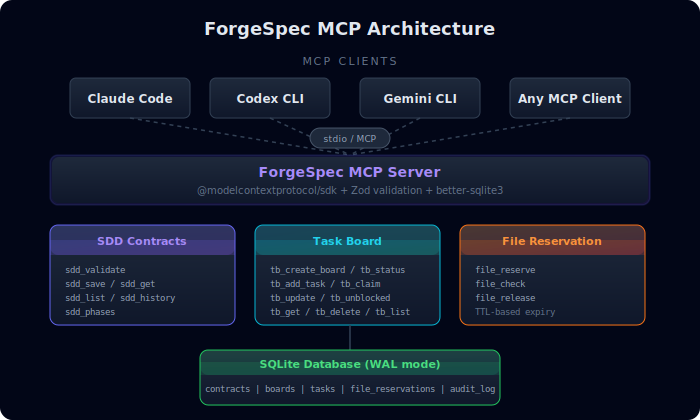

<p align="center">
  
</p>

<p align="center">
  
  
  
  
  
</p>

# ForgeSpec MCP

**The coordination backbone for multi-agent AI development.** ForgeSpec MCP is a [Model Context Protocol](https://modelcontextprotocol.io/) server that brings structured, auditable workflows to AI-powered software engineering through Spec-Driven Development (SDD).

---

## Why ForgeSpec?

Building software with multiple AI agents (Claude, Codex, Gemini, etc.) introduces coordination challenges that don't exist in single-agent workflows:

| Problem | Without ForgeSpec | With ForgeSpec |
|---------|-------------------|----------------|
| **Conflicting edits** | Two agents modify the same file simultaneously, causing merge conflicts and lost work | File reservation system with TTL prevents conflicts before they happen |
| **No shared context** | Each agent works in isolation; one agent's decisions are invisible to others | Contract validation creates a shared audit trail across all phases |
| **Unstructured work** | Agents jump straight to code without specs, producing inconsistent results | 9-phase pipeline enforces propose -> spec -> design -> implement flow |
| **Lost progress** | If an agent fails mid-task, there's no way to resume from where it left off | SQLite-backed task board persists state; any agent can pick up where another stopped |
| **No quality gates** | Code ships without validation against original requirements | Confidence thresholds block phase transitions until quality criteria are met |

### Key Advantages

- **Zero infrastructure** -- Embedded SQLite database, no external services required
- **Universal compatibility** -- Works with any MCP client: Claude Code, Codex CLI, Gemini CLI, OpenClaw, and more
- **Instant setup** -- One command to start: `npx -y forgespec-mcp`
- **Battle-tested pipeline** -- 9 phases with confidence thresholds prevent premature phase transitions
- **Audit trail** -- Every contract, task transition, and file reservation is logged with timestamps
- **Cross-platform** -- Tested on Ubuntu, Windows, and macOS with Node 18, 20, and 22

---

## Quick Start

### Using npx (no installation required)

```bash
npx -y forgespec-mcp
```

### Install globally

```bash
npm install -g forgespec-mcp
```

### Verify installation

```bash
forgespec-mcp --help
```

---

## Client Configuration

### Claude Code

```bash
claude mcp add forgespec --transport stdio -- npx -y forgespec-mcp
```

### Codex CLI (`~/.codex/config.toml`)

```toml
[mcp_servers.forgespec]
command = "npx"
args = ["-y", "forgespec-mcp"]
```

### Gemini CLI (`settings.json`)

```json
{
  "mcpServers": {
    "forgespec": {
      "command": "npx",
      "args": ["-y", "forgespec-mcp"]
    }
  }
}
```

### OpenClaw (`openclaw.json`)

```json5
mcp: {
  servers: {
    forgespec: { command: "npx", args: ["-y", "forgespec-mcp"] }
  }
}
```

---

## The SDD Pipeline

ForgeSpec enforces the **Spec-Driven Development** lifecycle -- a 9-phase pipeline that ensures AI agents work methodically rather than jumping straight to code.

<p align="center">
  
</p>

Each phase has a **confidence threshold** that must be met before transitioning to the next:

| Phase | Threshold | Purpose |
|-------|-----------|---------|
| `init` | 0.5 | Bootstrap project context and conventions |
| `explore` | 0.5 | Investigate codebase, diagnose issues |
| `propose` | 0.7 | Draft change proposal with scope and risks |
| `spec` | 0.8 | Write detailed specifications with Given/When/Then |
| `design` | 0.7 | Define architecture, data flows, file changes |
| `tasks` | 0.8 | Decompose into dependency-ordered implementation tasks |
| `apply` | 0.6 | Execute implementation (partial completion allowed) |
| `verify` | 0.9 | Validate implementation against specs |
| `archive` | 0.9 | Merge specs, generate retrospective |

---

## Tools Reference

ForgeSpec exposes **19 MCP tools** organized in three categories.

### SDD Contract Tools

Manage the development lifecycle with typed, validated contracts.

| Tool | Description |
|------|-------------|
| `sdd_validate` | Validate a contract against phase schema with confidence check |
| `sdd_save` | Validate and persist a contract to the database |
| `sdd_get` | Retrieve a single contract by ID |
| `sdd_list` | List contracts with optional project/phase filters |
| `sdd_history` | Get phase transition history for a project |
| `sdd_phases` | Get all phases with transitions and thresholds |

### Task Board Tools

SQLite-backed task management with dependency tracking and auto-unblocking.

| Tool | Description |
|------|-------------|
| `tb_create_board` | Create a new task board for a project |
| `tb_add_task` | Add a task with priority, spec ref, criteria, and dependencies |
| `tb_status` | Get board status with tasks grouped by status |
| `tb_claim` | Claim a task (validates dependencies before assignment) |
| `tb_update` | Update task status (auto-unblocks dependents on completion) |
| `tb_unblocked` | List tasks ready to work on (all dependencies resolved) |
| `tb_get` | Get full task details by ID |
| `tb_delete_task` | Delete a task (backlog/done only), cleans up dependencies |
| `tb_add_notes` | Append timestamped notes to a task |
| `tb_list` | List all boards (optionally filtered by project) |

### File Reservation Tools

Advisory file locking to prevent multi-agent edit conflicts.

| Tool | Description |
|------|-------------|
| `file_reserve` | Reserve files or glob patterns with configurable TTL |
| `file_check` | Check if files are reserved by another agent |
| `file_release` | Release reservations (specific patterns or all) |

---

## Usage Examples

### Example 1: Validate and save an SDD contract

An AI agent completing the "propose" phase saves its work as a validated contract:

```jsonc
// Tool: sdd_validate
{
  "contract": "{\"phase\":\"propose\",\"change_name\":\"add-auth-service\",\"project\":\"my-app\",\"status\":\"success\",\"confidence\":0.85,\"executive_summary\":\"Add JWT-based authentication service with login, logout, and token refresh endpoints. Affects 4 files in src/auth/.\",\"artifacts_saved\":[{\"topic_key\":\"sdd/add-auth-service/proposal\",\"type\":\"engram\"}],\"next_recommended\":[\"spec\",\"design\"],\"risks\":[{\"description\":\"Token storage strategy needs security review\",\"level\":\"medium\"}]}"
}

// Response:
{
  "valid": true,
  "phase": "propose",
  "confidence": 0.85,
  "threshold": 0.7,
  "meets_confidence": true,
  "allowed_next_phases": ["spec", "design", "init"],
  "warnings": []
}
```

```jsonc
// Tool: sdd_save (after validation)
{
  "contract": "{\"phase\":\"propose\",\"change_name\":\"add-auth-service\",\"project\":\"my-app\",\"status\":\"success\",\"confidence\":0.85,\"executive_summary\":\"Add JWT-based authentication service...\",\"next_recommended\":[\"spec\",\"design\"],\"risks\":[]}"
}

// Response:
{
  "saved": true,
  "id": "sdd_a1b2c3d4-...",
  "phase": "propose",
  "project": "my-app"
}
```

### Example 2: Create a task board and manage tasks

Set up a board, add tasks with dependencies, and let agents claim work:

```jsonc
// Step 1: Create a board
// Tool: tb_create_board
{ "project": "my-app", "name": "add-auth-service" }
// -> { "created": true, "board_id": "board_x7k9m2...", "project": "my-app" }

// Step 2: Add tasks with dependencies
// Tool: tb_add_task
{
  "board_id": "board_x7k9m2...",
  "title": "Create JWT utility module",
  "description": "Implement sign, verify, and refresh token functions",
  "priority": "p0",
  "spec_ref": "sdd/add-auth-service/spec",
  "acceptance_criteria": "All token operations pass unit tests",
  "dependencies": []
}
// -> { "created": true, "task_id": "task_abc123...", "priority": "p0" }

// Tool: tb_add_task
{
  "board_id": "board_x7k9m2...",
  "title": "Build auth middleware",
  "priority": "p1",
  "acceptance_criteria": "Middleware validates tokens on protected routes",
  "dependencies": ["task_abc123..."]  // depends on JWT module
}
// -> { "created": true, "task_id": "task_def456..." }

// Step 3: Agent claims a task
// Tool: tb_claim
{ "task_id": "task_abc123...", "agent": "implement-agent-1" }
// -> { "claimed": true, "task_id": "task_abc123...", "status": "in_progress" }

// Step 4: Mark task done (auto-unblocks dependents)
// Tool: tb_update
{ "task_id": "task_abc123...", "status": "done", "notes": "JWT module complete with RS256 support" }
// -> { "updated": true, "unblocked_tasks": ["task_def456..."] }
// task_def456 automatically moves from "backlog" to "ready"
```

### Example 3: Prevent file conflicts between agents

Two agents working in parallel use file reservations to avoid conflicts:

```jsonc
// Agent 1 reserves auth files
// Tool: file_reserve
{
  "patterns": ["src/auth/**", "src/middleware/auth.ts"],
  "agent": "implement-agent-1",
  "ttl_minutes": 30
}
// -> { "reserved": true, "expires_at": "2025-01-15T10:30:00.000Z" }

// Agent 2 checks before editing
// Tool: file_check
{
  "patterns": ["src/auth/jwt.ts"],
  "agent": "implement-agent-2"
}
// -> { "has_conflicts": true, "conflicts": [{ "pattern": "src/auth/**", "held_by": "implement-agent-1" }] }
// Agent 2 knows to work on something else

// Agent 1 finishes and releases
// Tool: file_release
{ "agent": "implement-agent-1" }
// -> { "released": true, "count": 2 }
```

### Example 4: Track project phase history

Review how a change progressed through the pipeline:

```jsonc
// Tool: sdd_history
{ "project": "my-app", "limit": 5 }

// Response:
{
  "project": "my-app",
  "history": [
    { "id": "sdd_...", "phase": "verify", "change_name": "add-auth-service", "status": "success", "confidence": 0.92, "created_at": "2025-01-15T10:45:00Z" },
    { "id": "sdd_...", "phase": "apply",  "change_name": "add-auth-service", "status": "success", "confidence": 0.78, "created_at": "2025-01-15T10:30:00Z" },
    { "id": "sdd_...", "phase": "tasks",  "change_name": "add-auth-service", "status": "success", "confidence": 0.88, "created_at": "2025-01-15T09:15:00Z" },
    { "id": "sdd_...", "phase": "spec",   "change_name": "add-auth-service", "status": "success", "confidence": 0.85, "created_at": "2025-01-15T09:00:00Z" },
    { "id": "sdd_...", "phase": "propose","change_name": "add-auth-service", "status": "success", "confidence": 0.85, "created_at": "2025-01-15T08:30:00Z" }
  ]
}
```

---

## Environment Variables

| Variable | Default | Description |
|----------|---------|-------------|
| `FORGESPEC_DIR` | `~/.forgespec` | Directory for database storage |
| `FORGESPEC_DB` | `~/.forgespec/forgespec.db` | Full path to SQLite database |

---

## Architecture

<p align="center">
  
</p>

```
forgespec-mcp
├── src/
│   ├── index.ts              # Entry point: stdio transport
│   ├── server.ts             # MCP server setup and tool registration
│   ├── types/index.ts        # Zod schemas, phase config, type definitions
│   ├── database/index.ts     # SQLite init, WAL mode, schema creation
│   ├── tools/
│   │   ├── sdd-contracts.ts  # 6 contract lifecycle tools
│   │   ├── task-board.ts     # 10 task management tools
│   │   └── file-reservation.ts # 3 file locking tools
│   └── utils/id.ts           # Prefixed UUID generation
└── tests/
    ├── sdd-contracts.test.ts # Schema and phase transition tests
    └── tools.test.ts         # Integration tests for all CRUD operations
```

**Tech stack:**
- [Model Context Protocol SDK](https://github.com/modelcontextprotocol/typescript-sdk) -- MCP server framework
- [better-sqlite3](https://github.com/WiseLibs/better-sqlite3) -- Embedded database with WAL mode
- [Zod](https://github.com/colinhacks/zod) -- Runtime schema validation
- [Vitest](https://vitest.dev/) -- Testing framework with v8 coverage

---

## Development

```bash
# Clone the repository
git clone https://github.com/lleontor705/forgespec-mcp.git
cd forgespec-mcp

# Install dependencies
npm install

# Run in development mode (hot reload)
npm run dev

# Run tests
npm test

# Run tests in watch mode
npm run test:watch

# Build for production
npm run build

# Open MCP Inspector for debugging
npm run inspect
```

### Releasing a New Version

ForgeSpec uses [standard-version](https://github.com/conventional-changelog/standard-version) for automatic semantic versioning based on [Conventional Commits](https://www.conventionalcommits.org/).

```bash
# Commits determine the version bump automatically:
#   fix: ...    -> patch (1.2.0 -> 1.2.1)
#   feat: ...   -> minor (1.2.0 -> 1.3.0)
#   feat!: ...  -> major (1.2.0 -> 2.0.0)

# Create a release (bumps version, updates CHANGELOG, creates git tag)
npm run release

# Or specify the bump type manually
npm run release -- --release-as minor
npm run release -- --release-as major

# First release from current version
npm run release -- --first-release

# Push with tags to trigger CI/CD
git push --follow-tags origin master
```

The CI/CD pipeline then:
1. Runs tests across Ubuntu/Windows/macOS with Node 18, 20, 22
2. Waits for production environment approval
3. Publishes to npm with provenance
4. Creates a GitHub release with auto-generated notes

---

## Contributing

1. Fork the repository
2. Create a feature branch: `git checkout -b feature/my-feature`
3. Use [Conventional Commits](https://www.conventionalcommits.org/) for your messages:
   - `feat: add new tool for X`
   - `fix: resolve race condition in file reservation`
   - `docs: update usage examples`
4. Run tests: `npm test`
5. Push and open a Pull Request

---

## License

[MIT](LICENSE) -- built by [lleontor705](https://github.com/lleontor705)
