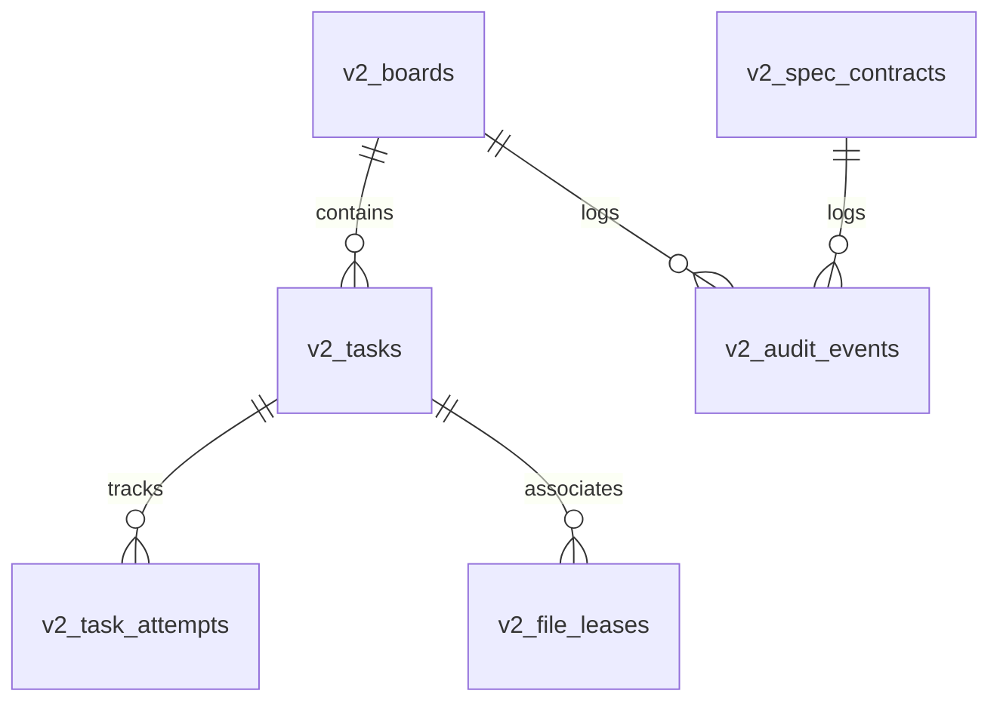

# ForgeSpec MCP v2.0 Architecture & Design

## Overview

ForgeSpec MCP v2 is designed as a high-performance, race-safe, and token-efficient coordination platform for multi-agent AI engineering teams.

---

## 1. Unified SQLite Engine

The storage engine is built on **better-sqlite3** with high-throughput configurations:
- `journal_mode = WAL`: Concurrent read/write without read blocking.
- `synchronous = normal`: High write performance with full power-loss durability.
- `cache_size = -64000`: 64 MB dedicated page cache.
- `busy_timeout = 10000`: 10-second automatic wait on contention.
- `foreign_keys = ON`: Strict relational integrity.
- `STRICT` tables and `JSON1` validation.

---

## 2. Core Entity Model

---

## 3. Concurrency & Security Architecture (OWASP GenAI)

1. **Anti-Tool Poisoning**: Zod `.strict()` declarative schemas prevent indirect prompt injection attacks.
2. **Path Sanitization**: Canonical POSIX path normalization rejects directory traversal (`../`).
3. **CAS (Compare-And-Swap)**: Optimistic revision locks prevent split-brain updates.
4. **Advisory Leases with TTL**: Automated expiry prevents orphaned locks when agents crash or run out of context.
