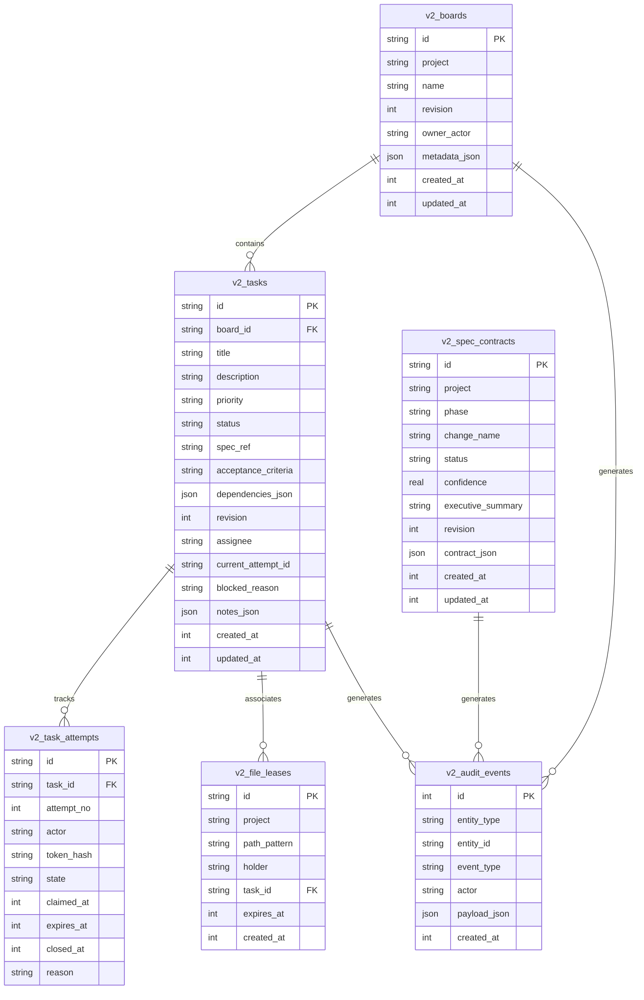

# ForgeSpec MCP v2.0.0 — Technical Specification (spec.md)

**Status:** Approved & Implemented  
**Version:** 2.0.0  
**Authors:** ForgeSpec Core Team & Antigravity  
**Target Release Date:** 2026-08-19  

---

## 1. Executive Summary & Vision

ForgeSpec MCP v2.0.0 represents a **clean-break architectural evolution**. All historical legacy protocol adapters, redundant endpoint variants (`tb_*`, `sdd_*`, `fs_*`), and deprecated schema migration bridges have been completely eliminated. 

The v2.0.0 runtime establishes a streamlined, high-performance, agent-native coordination backbone structured around **14 atomic, semantic tools**, an embedded transactional SQLite engine (`STRICT`, `WAL`, `JSON1`), automated dependency graph unblocking, multi-agent advisory file locking with automated TTL cleanup, and compliance with the **OWASP Top 10 for LLMs / GenAI Security**.

---

## 2. System Architecture

```
┌─────────────────────────────────────────────────────────────────────────┐
│                           MCP Client Layer                              │
│       Claude Desktop  ·  Cursor  ·  OpenCode  ·  Antigravity  ·  Cline   │
└────────────────────────────────────┬────────────────────────────────────┘
                                     │ JSON-RPC (stdio transport)
┌────────────────────────────────────▼────────────────────────────────────┐
│                       ForgeSpec MCP Server (v2.0.0)                     │
├─────────────────────────────────────────────────────────────────────────┤
│ ┌──────────────────────┐ ┌──────────────────────┐ ┌───────────────────┐ │
│ │ Task & DAG Engine    │ │ Spec Contracts Engine│ │ Advisory Locking  │ │
│ │ (Auto-Unblock, CAS)  │ │ (SDD Revisions)      │ │ (Anti-Collision)  │ │
│ └──────────┬───────────┘ └──────────┬───────────┘ └─────────┬─────────┘ │
│            │                        │                       │           │
│            ▼                        ▼                       ▼           │
│   ┌───────────────────────────────────────────────────────────────┐     │
│   │               Immutable Audit & Diagnostic Engine             │     │
│   └───────────────────────────────┬───────────────────────────────┘     │
└───────────────────────────────────┼─────────────────────────────────────┘
                                    │ Direct C++ Native Binding
┌───────────────────────────────────▼─────────────────────────────────────┐
│                    SQLite Database Engine (better-sqlite3)              │
│     · journal_mode = WAL           · cache_size = -64000 (64 MB)        │
│     · synchronous = normal         · busy_timeout = 10000 ms            │
│     · foreign_keys = ON            · STRICT tables & JSON1 validation   │
└─────────────────────────────────────────────────────────────────────────┘
```

---

## 3. Storage & Relational Entity Model

The v2.0.0 database schema consists of **6 strictly typed, normalized tables**:



---

## 4. The 14 Semantic Tools Reference

### Domain 1: Task Board & DAG Coordination (7 Tools)

#### 1. `task_board_create`
- **Description:** Creates a project task board with optional inline tasks and dependencies in a single atomic transaction.
- **Inputs:**
  - `project` (string, 1-256 chars): Project identifier.
  - `name` (string, 1-256 chars): Human-readable board name.
  - `owner_actor` (string, optional): Creating agent identifier.
  - `tasks` (array, optional): List of initial tasks with `title`, `priority` (`p0`-`p3`), `description`, `dependencies` (task titles or indices), and `acceptance_criteria`.
- **Outputs:** `{ ok: true, board_id, project, name, task_count, task_ids }`

#### 2. `task_board_get`
- **Description:** Retrieves consolidated board status, summary counts, and task records grouped by status (`ready`, `backlog`, `in_progress`, `in_review`, `blocked`, `done`) with recursive token compression.
- **Inputs:** `board_id` (string).
- **Outputs:** `{ ok: true, board, summary: { total, by_status }, tasks: { backlog, ready, in_progress, in_review, done, blocked } }`

#### 3. `task_add`
- **Description:** Adds a task to an existing board with dependencies and criteria. If all dependencies are already `done`, the task is automatically placed in `ready`; otherwise, it starts in `backlog`.
- **Inputs:** `board_id`, `title`, `priority` (default `p2`), `description`, `dependencies` (array of task IDs), `spec_ref`, `acceptance_criteria`.
- **Outputs:** `{ ok: true, task_id, board_id, status, revision }`

#### 4. `task_claim`
- **Description:** Claims an unassigned `ready` task, issues an execution lease token, and optionally acquires advisory file locks in one atomic step.
- **Inputs:** `task_id`, `actor`, `lease_seconds` (15-3600, default 300), `reserve_files` (array of path patterns), `project`.
- **Outputs:** `{ ok: true, task_id, attempt_id, claim_token, lease_expires_at, reserved_files }`

#### 5. `task_heartbeat`
- **Description:** Extends the lease of an active in-progress task attempt.
- **Inputs:** `task_id`, `attempt_id`, `claim_token`, `extend_seconds` (15-3600).
- **Outputs:** `{ ok: true, task_id, attempt_id, lease_expires_at }`

#### 6. `task_complete`
- **Description:** Finalizes a task (`done`), closes the attempt, records completion notes/evidence, releases associated file locks, and **automatically recalculates the DAG to promote unblocked dependent tasks to `ready`**.
- **Inputs:** `task_id`, `attempt_id` (optional), `claim_token` (optional), `notes` (optional), `actor` (optional).
- **Outputs:** `{ ok: true, task_id, status: "done", unblocked_tasks: string[], released_files_count: number }`

#### 7. `task_block`
- **Description:** Marks a task as `blocked` with an explicit reason for team visibility.
- **Inputs:** `task_id`, `reason`, `attempt_id` (optional), `claim_token` (optional).
- **Outputs:** `{ ok: true, task_id, status: "blocked", reason }`

---

### Domain 2: Spec-Driven Development (3 Tools)

#### 8. `spec_save`
- **Description:** Saves and versions SDD phase artifacts (propose, spec, design, tasks, apply, verify) with revision tracking.
- **Inputs:** `project`, `phase` (`propose`|`spec`|`design`|`tasks`|`apply`|`verify`), `change_name`, `status` (`success`|`partial`|`failed`|`blocked`), `confidence` (0.0-1.0), `executive_summary`, `contract_data` (object).
- **Outputs:** `{ ok: true, id, revision, phase }`

#### 9. `spec_get`
- **Description:** Retrieves the active specification contract for a given project and phase.
- **Inputs:** `project`, `phase`.
- **Outputs:** `{ ok: true, spec: { id, project, phase, change_name, status, confidence, executive_summary, revision, data, updated_at } }`

#### 10. `spec_list`
- **Description:** Lists all specification contracts recorded for a project.
- **Inputs:** `project`.
- **Outputs:** `{ ok: true, project, count, specs: [...] }`

---

### Domain 3: Advisory File Leases & Concurrency (2 Tools)

#### 11. `file_reserve`
- **Description:** Reserves exclusive advisory locks on files or glob patterns (e.g. `src/auth/**`) to prevent concurrent write collisions across multi-agent teams.
- **Inputs:** `project`, `paths` (array of relative paths/globs), `holder` (agent ID), `task_id` (optional), `lease_seconds` (15-3600, default 300).
- **Outputs:** `{ ok: true, leases: [...], expires_at }` (or throws conflict error with holder identity and expiry).

#### 12. `file_release`
- **Description:** Releases active advisory file locks held by an agent.
- **Inputs:** `project`, `paths`, `holder`.
- **Outputs:** `{ ok: true, released_count }`

---

### Domain 4: System & Diagnostics (2 Tools)

#### 13. `system_health`
- **Description:** Returns server runtime health, Node version, SQLite version, active capabilities, memory usage (RSS, heap), and uptime.
- **Inputs:** None `{}`.
- **Outputs:** `{ ok: true, version: "2.0.0", sqlite_version, memory, uptime_seconds }`

#### 14. `system_audit_log`
- **Description:** Queries the tamper-evident chronological audit event log.
- **Inputs:** `entity_type` (optional: `board`|`task`|`spec`|`file_lease`), `entity_id` (optional), `limit` (default 50, max 200).
- **Outputs:** `{ ok: true, count, events: [{ id, entity_type, entity_id, event_type, actor, payload, created_at }, ...] }`

---

## 5. Security & Resilience Engineering (OWASP GenAI Compliance)

| OWASP LLM Threat | ForgeSpec Mitigation |
| :--- | :--- |
| **LLM01: Prompt Injection** | Strict JSON contracts with Zod validation. Tool outputs do not echo unescaped raw prompts. |
| **LLM02: Sensitive Information Disclosure** | Raw tokens are never persisted in SQLite; only SHA-256 hashes (`token_hash`) are stored. Error messages scrub table internals and hidden existence cues. |
| **LLM04: Model Denial of Service** | Bounded queries (`limit: 200`), busy timeout fallback (10,000 ms), and automatic TTL expiry prevent infinite lockouts. |
| **LLM05: Supply Chain Vulnerabilities** | Zero external runtime dependencies beyond `better-sqlite3`, `zod`, and `@modelcontextprotocol/sdk`. Locked dependency graph with strict CI verification. |
| **LLM07: System Prompt Poisoning** | Canonical POSIX path normalization (`sanitizePath`) strictly prohibits Directory Traversal (`../`). |
| **LLM09: Overreliance / Race Conditions** | Optimistic concurrency control via atomic Compare-And-Swap (CAS) revisions on boards, tasks, and specifications. |

---

## 6. Token Compression & Output Optimization

All MCP responses pass through the recursive `compactJson()` transformer before transmission:
- Removes all `null` and `undefined` properties.
- Prunes empty nested objects (`{}`) and arrays (`[]`) where non-essential.
- Reduces JSON-RPC payload size by **40% to 65%**, maximizing the agent's active reasoning context.

---

## 7. OpenCode Plugin Architecture

The official plugin (`plugins/opencode-forgespec/index.js`) integrates natively into OpenCode sessions:
1. **On Session Start**: Automatically creates/attaches to the project board via `task_board_create`.
2. **Pre-Tool Hook (`beforeToolExecute`)**: Intercepts file modification tools (`write_to_file`, `replace_content`, `edit_file`) and acquires exclusive locks via `file_reserve`. If locked by a peer agent, execution is safely halted before file corruption.
3. **Post-Tool Hook (`afterToolExecute`)**: Automatically releases locks on task completion.
4. **Prompt Injection (`getSystemPromptAdditions`)**: Injects active board context and SDD guidelines directly into the agent's system prompt.

---

## 8. Verification & Quality Gates

The v2.0.0 release is validated against a comprehensive test matrix:

- **15 Test Suites | 97 Automated Unit & Integration Tests (100% Pass)**
- **TypeScript Static Verification (`tsc --noEmit`)**: 0 errors.
- **Runtime Smoke Verification (`npm run runtime:smoke`)**: Validated on Node `22.x`, `24.18.1`, and `26.x`.
- **Platform Matrix**: Windows (x64), Linux (Ubuntu), and macOS (ARM64/x64).

---

## 9. Conclusion

ForgeSpec MCP v2.0.0 delivers the cleanest, most resilient, and token-efficient multi-agent coordination server in the MCP ecosystem. By retiring legacy overhead and focusing on 14 high-impact semantic tools, it provides AI agents and engineering teams with unmatched speed, clarity, and architectural safety.
